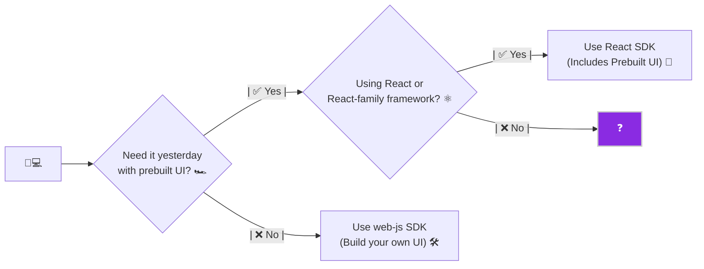

# How SuperTokens integrates with web apps

```mermaid {theme: 'dark', scale: 0.73}
graph LR
    A["🙎💻"] --> B{"Need it yesterday<br>with prebuilt UI? 🏎️"}
    B -- "|  ✅ Yes  |" --> C{"Using React or<br>React-family framework? ⚛️"}
    B -- "|  ❌ No   |" --> D["Use web-js SDK<br>(Build your own UI) 🛠️"]

    C -- "|  ✅ Yes  |" --> E["Use React SDK<br>(Includes Prebuilt UI) 🎉"]
    C -- "|  ❌ No   |" --> F["❓"]

    style F fill:#8a2be2,stroke:#ccc,stroke-width:2px,color:#fff
```

